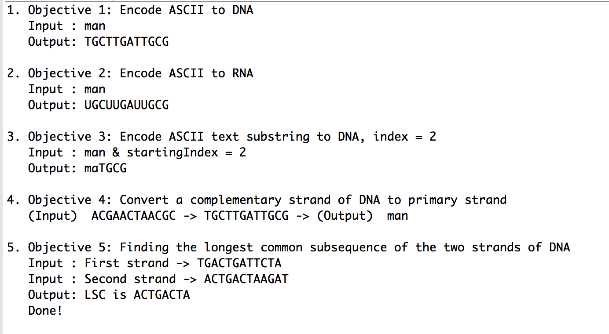

Programming Test Solutions - Java - Minh Pham
==================

This project is to answer all the questions, including Objective 1, 2, 3, 4 and 5.

### Requirements
- IDE: Eclipse
- Languague: Java

## Output ScreenShot

## Referrence Links
- Convert to int to 8 bit binary: [(link)](https://stackoverflow.com/questions/34192964/convert-binary-string-to-an-8-bit-array-of-integers-in-java?rq=1&utm_medium=organic&utm_source=google_rich_qa&utm_campaign=google_rich_qa)

- Theory of DNA: [(link)](https://hackerfall.com/story/converting-words-to-dna-segments)

- Defination of Longest common subsequence (LCS) : [(link)](https://image.slidesharecdn.com/5-150507111808-lva1-app6892/95/53-dynamic-programming-03-25-638.jpg?cb=1430997552)

- Algorithm finding LCS: [(link)](http://www.cs.cmu.edu/afs/cs/academic/class/15451-s15/LectureNotes/lecture04.pdf)

